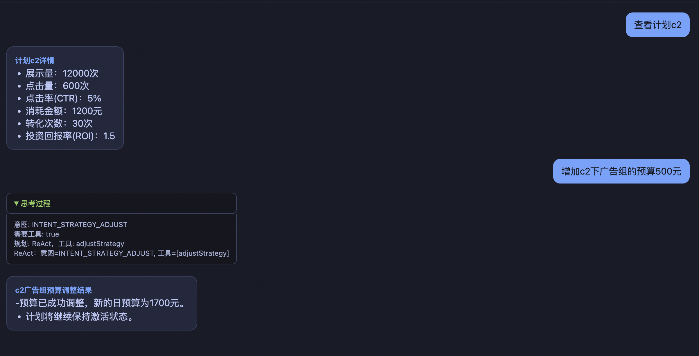
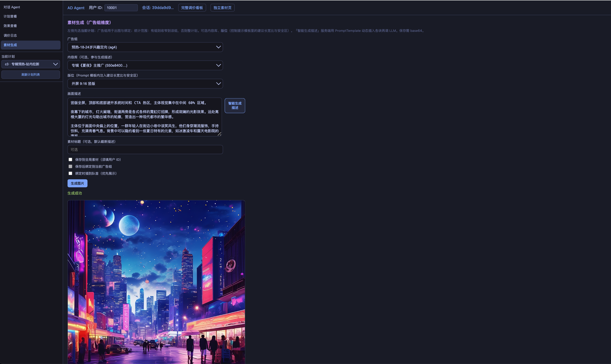
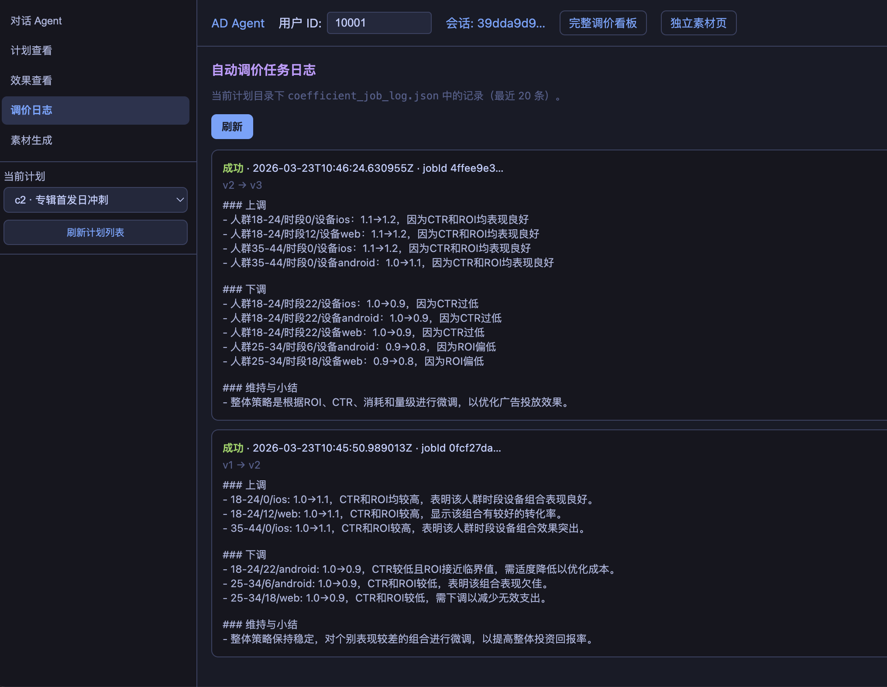

# ad_agent

[更新日志（CHANGELOG）](CHANGELOG.md)

- **自动调价助手**：基于定时任务与模型，按最细策略粒度分析投放效果并动态调整出价系数，提升 ROI。
- **素材与文生图**：对话页 **素材生成** Tab（广告组维度智能描述 + 文生图、绑定素材）；实验页 [文生图（通义万相）](http://localhost:8081/creative-gen.html)（需 `spring.ai.model.image=dashscope` 与 DashScope `api-key`）。
- 广告投放垂类 Agent：使用自然语言做投放效果查询、投放计划与策略建议，动态修改投放计划。支持多用户隔离、长期记忆与聊天记录持久化（学习项目，数据为本地/测试数据）。

## 项目介绍

ad_agent 是一个面向广告投放场景的对话式 Agent，主要能力包括：

- **自动调价助手**：定时拉取所有投放计划的效果数据，智能分析出**最细粒度策略**（人群 × 设备 × 时段），针对该粒度**动态调整出价因子（α）**，提升广告 ROI。
- **广告组维度素材生成**：在对话页 **素材生成** Tab 选定广告组与可选内容库、版位；结合高表现素材与推广文案，由大模型生成画面描述并**文生图**，可保存到全局素材并**绑定到当前广告组**（与独立页 `creative-gen.html` 互补）。
- **效果与计划查询**：查展示、点击、CTR、消耗、ROI、每日趋势，以及计划/广告组/广告/素材列表与详情
- **投放操作**：自然语言操作新建计划、调整预算与启停状态，变更后自动生成效果数据
- **多用户隔离**：按用户 ID 隔离基础数据与效果数据，不同用户互不影响
- **记忆与历史**：短期记忆（当前会话对话）、长期记忆（用户习惯/投放偏好，按用户分文件）、聊天记录持久化与多会话管理
- **隐私清除与页面联动**：用户可通过自然语言清除**仅长期记忆**、**仅聊天记录**或**两者**；服务端识别意图后直接删对应本地文件（不依赖模型是否调工具）。清除成功后静态页可自动刷新，SSE 可下发 `client` 事件同步会话状态。
- **流式回复与思考过程**：支持 SSE 流式输出，可展开查看意图识别、规划与工具调用过程。

技术栈：Spring Boot、Spring AI（千问 / DashScope）、提示词外置（`classpath:prompts/*.txt` + `ClasspathPromptLoader`）、本地 JSON 文件存储。

**关于用户身份**：本仓库为学习项目，**用户仅通过一个 ID（如 10000、u1）标识**，无登录、注册、鉴权等流程；前端将用户 ID 保存在本地并随请求传入，后端按该 ID 隔离数据与记忆。生产环境需接入真实账号体系与权限。

---

## 对话工作台（`/chat.html`）

> **入口**：[http://localhost:8081/chat.html](http://localhost:8081/chat.html)  
> 左侧 Tab：**对话 Agent**、**计划查看**、**效果查看**（投放效果明细，与下方调价日志分离）、**调价日志**、**素材生成**。与头部 **用户 ID**、侧栏 **当前计划** 联动；在 **计划查看** 的结构树中点击某条 **素材** 可跳转到 **效果查看** 并仅展示该素材相关明细（见下图）。

<details open>
<summary><strong>对话 Agent</strong>（流式回复、思考过程；点击隐藏截图）</summary>



</details>

<details open>
<summary><strong>素材生成</strong>（广告组、内容库、版位、智能生成描述、文生图；点击隐藏截图）</summary>



</details>

<details open>
<summary><strong>调价日志</strong>（点击隐藏截图）</summary>



</details>

---

## 自动调价助手（B×α）

> 按 **用户 ID → 计划列表 → 计划详情** 查看 **投放效果**（`performance.json` 多维度汇总与明细），并在 **每个计划** 下独立维护 **B×α 网格**、执行 **LLM 调价**，在页面底部查看 **任务日志（job log）**（含程序生成的涨跌概要与模型给出的调价依据）。  
> **入口**：[http://localhost:8081/bid-strategy.html](http://localhost:8081/bid-strategy.html)（用户 ID 与对话页一致，共用本地存储键 `adAgentUserId`）。

汇总卡片 + 按日期/渠道/年龄段/广告组/广告等 **细分（breakdown）** 的效果明细；人群 × 时段 × 设备 维度的 B×α 网格与调价操作；任务日志含涨跌概要（旧 α→新 α）与 **LLM 说明**。每计划数据目录：`data/bid/campaigns/<计划ID>/`。

完整设计：[docs/ai_design_doc/bid-coefficient-agent.md](docs/ai_design_doc/bid-coefficient-agent.md)

---

## 涉及的知识点

本项目在实现对话式投放 Agent 时涉及以下知识点，便于对照学习与扩展：

| 知识点 | 说明 | 在本项目中的体现 |
|--------|------|------------------|
| **意图识别** | 从用户自然语言中判断其意图类型（查效果、查计划、加计划、改策略、清除记忆/聊天等），决定是否需调用工具。 | 感知层 `IntentRecognitionService` 调用 LLM 输出 `intentType`、`needsTool`；会注入**最近对话**以识别用户对上一轮追问的简短确认（如「需要」「好的」），用于后续规划与工具选择。隐私类意图含 `INTENT_CLEAR_LONG_TERM_MEMORY`、`INTENT_CLEAR_CHAT_HISTORY`、`INTENT_CLEAR_ALL_USER_MEMORY`（详见 `docs/ai_design_doc/memory-privacy-intent-and-tools.md`）。 |
| **实体抽取 / 实体映射** | 从语句中抽取关键实体，供工具调用时传参。 | `EntityExtractionService` 以**轻量规则**为主（如计划 ID 的 `campaignId` 正则、`numbers` 列表）；预算、启停等细粒度参数主要由 **LLM 在工具调用时**从上下文映射填充。 |
| **行动规划** | 根据意图与上下文决定执行路径（推理方式、选用哪些工具）。 | 规划层 `PlanningService` 选择 CoT 或 ReAct；`ReActService` 将意图映射到工具列表（如效果查询 → queryPerformance）。 |
| **工具调用** | Agent 将「规划结果」转化为对具体工具的调用（名称 + 参数），并拿到结果再生成回复。 | `ToolExecutionService` 驱动 ChatClient；工具包括 `queryBaseData`、`queryPerformance`、`addCampaign`、`adjustStrategy`，以及隐私类 `clearUserLongTermMemory`、`clearUserChatHistory`（`UserPrivacyTools`）。**隐私清除**在编排器内会**同步执行磁盘删除**，避免仅依赖 LLM 调工具导致「口头已删、文件仍在」。 |
| **短期记忆** | 当前会话内的多轮对话内容，用于上下文连贯与补全信息。 | `ShortTermMemoryService` 在内存中按 sessionId 维护消息列表，构建上下文注入 Prompt，便于模型理解「上一句说了什么」。 |
| **长期记忆** | 跨会话、跨轮次的用户偏好或习惯，用于个性化回复与建议。 | `LongTermMemoryService` 按用户将「习惯/偏好」写入 `data/long_term_memory/{userId}.json`；每轮或空闲后由 LLM 判断是否写入，并与已有记忆去重；检索时取最近若干条注入上下文。 |
| **用户多会话保存** | 同一用户可拥有多个会话，每个会话有独立历史，刷新或换设备后仍可加载。 | 聊天记录按会话存 `data/chat/sessions/{sessionId}.json`，按用户建索引 `data/chat/users/{userId}/sessions.json`；前端可拉会话列表、选会话、拉历史，并支持删除会话。清除聊天记录时会合并**索引中的会话 ID**与**扫描 sessions 目录**（按文件内 `userId` 匹配），减少漏删。 |
| **提示词外置** | 将各场景 System / User 提示放在资源文件中，便于迭代与版本管理。 | `src/main/resources/prompts/*.txt`；`ClasspathPromptLoader` + `PromptResourcePaths` 统一加载与占位符渲染（说明见 `prompts/README.md`）。 |
| **流式正文净化** | 在流式输出中抑制模型偶发的「伪工具调用」等噪声，避免污染用户可见正文。 | `agent/execution/ReplySanitizer`（由编排 / 控制器在 SSE 路径使用，与 UI「思考过程」展示配合）。 |
| **创意与文生图** | 按广告组维度生成画面描述并调用文生图 API，管理内容库与全局素材。 | `creative/*`（如 `CreativeImageService`、`CreativePromptSuggestService`、`CreativeCatalogService`）、`CreativeImageController` / `CatalogController`；独立实验页 `static/creative-gen.html`；图片资产见 `config/CreativeAssetWebConfig` 与 `data/creative/assets/`。 |

以上串联起来即：**用户输入 → 意图识别 + 实体抽取 → 行动规划 → 工具调用（含短期/长期记忆上下文）→ 生成回复**；同时**短期记忆**维护当前会话，**长期记忆**沉淀用户偏好，**多会话**通过持久化与索引支持「一用户多会话、历史可加载」。

---

## 快速开始

### 1. 配置千问 API 密钥（可自行更换为其他模型）

密钥放在单独文件中且已加入 `.gitignore`，不会误提交。当前默认使用阿里云通义千问（DashScope）；**如需使用其他模型**（如 OpenAI、Azure OpenAI、智谱等），只需在 `application.yml` 中改为对应 provider 的配置，并在 `application-secret.yml` 中填写该 provider 的 API Key 即可。

```bash
cp src/main/resources/application-secret.yml.example src/main/resources/application-secret.yml
# 编辑 application-secret.yml，将 your-dashscope-api-key-here 替换为你的 DashScope API Key（若使用千问）
```

### 2. 启动服务

```bash
mvn spring-boot:run
```

服务端口：**8081**。

### 3. 打开对话页

浏览器访问：**http://localhost:8081/chat.html**

- 在顶部填写**用户 ID**（必填以启用多用户隔离），会保存到本地
- 左侧为会话列表，可「新会话」或选择历史会话，刷新后自动加载
- 输入问题即可对话，支持流式回复与「思考过程」展开
- 若说出**清除长期记忆 / 清空聊天记录 / 全部清除**等且携带有效 **userId**，服务端删除对应文件后，静态页会在约 0.4 秒后**自动刷新**（并清除本地保存的 sessionId）

### 4. 自动调价助手（B × α）

浏览器访问：**http://localhost:8081/bid-strategy.html**

1. 填写与对话页相同的 **用户 ID**，点击 **「加载计划列表」**。
2. 点击某一计划进入 **详情**：查看 **投放效果**（汇总 + 明细表）、计划结构；若无效果数据可先点 **「生成效果样本（追加 7 天）」**。
3. 在同一页操作 **本计划 B×α**：**重造效果快照**、**执行调价（LLM）**、**重造快照并调价**（需配置千问密钥）；底部查看 **任务日志**。
4. 每计划出价与日志在 `data/bid/campaigns/<计划ID>/`，与全局 `data/bid/*.json` 互不覆盖。

定时任务默认 **每小时** 按 `ad-agent.bidding.schedule-user-id`（空则读全局 `campaigns.json`）**对每个计划分别**跑一次调价；可用 `ad-agent.bidding.enabled: false` 关闭。设计说明：[docs/ai_design_doc/bid-coefficient-agent.md](docs/ai_design_doc/bid-coefficient-agent.md)

### 5. 素材生成（对话页 Tab）

在 **http://localhost:8081/chat.html** 左侧切换到 **素材生成**：选择 **广告组**、可选 **内容库** 与 **版位**，可点击 **智能生成描述** 再 **生成图片**；勾选可将结果写入全局素材并绑定到当前广告组。需配置对话用 LLM；文生图另需 `spring.ai.model.image=dashscope` 与 DashScope `api-key`（详见 `application.yml` 与 `application-secret.yml`）。

### 6. 可选：独立文生图实验页

访问 **http://localhost:8081/creative-gen.html** 做不依赖对话页的通义万相实验；配置要求同上。

---

## 使用说明

### 对话示例

- 「有哪些投放计划」「计划 c2 的详情」
- 「查一下 c2 最近 7 天效果」「每日数据呢」
- 「加一个投放计划，名字叫拉新，日预算 5000」
- 「把 c2 的日预算调到 15000」「暂停计划 c1」
- 「清除长期记忆」「清空聊天记录」「长期记忆和聊天都删掉」（需在请求中传 **userId**，与数据目录中的用户一致）

隐私相关意图、工具与页面刷新约定见：[memory-privacy-intent-and-tools.md](docs/ai_design_doc/memory-privacy-intent-and-tools.md)。

### 可选配置（application.yml）

| 配置项 | 说明 | 默认 |
|--------|------|------|
| `ad-agent.data.base-path` | 本地数据根目录 | `./data` |
| `ad-agent.memory.immediate-long-term-flush` | 长期记忆写入时机：`true`=每轮结束立即写入，`false`=空闲 5 分钟后写入 | `true` |
| `ad-agent.bidding.enabled` | 是否启用自动调价助手定时任务 | `true` |
| `ad-agent.bidding.cron` | `@Scheduled` 使用的**六段** cron（**秒** 分 时 日 月 周），默认每小时整点 | `0 0 * * * ?` |
| `ad-agent.bidding.alpha-min` / `alpha-max` | 系数 α 绝对上下界 | `0.5` / `1.5` |
| `ad-agent.bidding.max-relative-change` | 单周期相对上一版 α 最大变化比例 | `0.2` |
| `ad-agent.bidding.schedule-user-id` | 定时任务遍历该用户下所有计划分别调价；空则读全局 `campaigns.json` | `""` |

### 数据目录确认

启动后请求 **`GET /api/ad-agent/data-path`**（端口与 `server.port` 一致，默认 8081），可查看当前数据根目录与关键数据文件路径。

---

## 安全管控与生产落地建议

当前项目为学习/演示用途，**加计划、改预算、启停**等写操作会直接落库。接入真实投放平台、用于生产时，必须对写操作做安全管控，避免误操作或越权导致资金与投放风险。

### 管控原则

- **查询类**（计划列表、效果数据、详情）：可继续由 Agent 直接调用投放平台 API 或数据服务，返回结果给用户。
- **变更类**（新建计划、修改预算、暂停/启用计划等）：**不得由 Agent 直接执行**，应走「生成待办 → 审批 → 审批通过后再执行」的流程。

### 建议：打通内部 OA 审批

将 Agent 的写操作与公司内部 OA 审批流程打通，实现「对话提议、OA 审批、回调执行」的闭环：

1. **Agent 侧**  
   当识别到用户意图为加计划、改预算、启停等时，工具层**不直接调用投放平台写接口**，而是：
   - 生成结构化「待执行操作」（如：`{ action: "adjustStrategy", campaignId: "c2", dailyBudget: 15000 }`），
   - 调用内部** OA 审批接口**发起审批单（标题、说明、申请人、审批人、回调地址等），
   - 将上述操作参数与 `sessionId` / `userId` 一并存入审批单扩展字段或关联业务表，供回调使用。
2. **OA 侧**  
   审批单在 OA 内流转，审批人可查看「将要执行的操作」说明，通过/驳回。
3. **审批回调**  
   **仅在审批通过时**，由 OA 调用本系统提供的**审批通过回调接口**（具体 URL 由双方对接约定），传入审批单 ID、通过状态等；本系统根据审批单 ID 取出之前保存的「待执行操作」参数，**在回调逻辑里调用投放平台 API 执行真实的修改计划操作**（新建计划、改预算、启停等），并落库或同步状态。
4. **用户侧**  
   对话中可回复「已为您发起预算调整审批，审批通过后将自动生效」，并支持查询审批状态或提供审批单链接。

这样可实现：**所有对计划的真实修改都经过 OA 审批，且仅在审批回调中执行**，Agent 只负责理解意图、生成操作参数并发起审批，不直接写投放平台。

### 实施要点小结

| 环节 | 建议 |
|------|------|
| Agent 工具层 | 变更类工具改为「生成操作 + 调 OA 发起审批」，不直接写投放平台。 |
| 审批单 | 存储操作类型、参数（campaignId、dailyBudget、status 等）、申请人、sessionId/userId，便于回调时精确执行。 |
| 回调接口 | 校验签名/来源，根据审批单 ID 取参数，调用投放平台 API 执行修改，并记录日志便于审计。 |
| 权限 | 审批人、回调接口访问权限按现有 OA 与系统权限体系控制。 |

---

## 生产环境建议（中间件与存储）

当前项目使用本地 JSON 文件存储，适用于学习与单机演示。上线生产时，建议按数据类型替换为以下中间件，便于扩展、多实例与运维。**不以 MySQL/PostgreSQL 为主**，长期记忆采用向量库并按**问题语义**注入。

### 存储与中间件选型

| 数据类型 | 当前实现 | 生产建议中间件 | 说明 |
|----------|----------|----------------|------|
| **短期记忆**（当前会话多轮） | 进程内存 `ShortTermMemoryService` | **Redis** | 按 `sessionId` 存消息列表，设 TTL（如 1～24 小时），多实例共享；会话结束或过期自动清理。 |
| **长期记忆**（用户习惯/偏好） | 本地文件 `long_term_memory/{userId}.json` | **向量库**（Milvus / Qdrant / Pinecone / pgvector 等） | **按当前问题语义注入**：对每条记忆与当前 query 做 embedding，按向量相似度取 topK 注入上下文。按 `userId` 隔离，写入时落库并建向量索引，检索时用 query 向量查最相关记忆。 |
| **基础数据**（计划/广告组/广告/素材） | 本地文件 `base/users/{userId}/campaigns.json` | 业务存储（自建或投放平台 API 同步） | 生产多从投放平台 API 同步或自建投放系统；具体存储由现有业务架构决定。 |
| **效果数据**（展示、点击、消耗、ROI） | 本地文件 `performance/users/{userId}/performance.json` | **ClickHouse / Hive / BigQuery** 等数仓或 OLAP | 数据量大、按天/计划/维度聚合分析；可定时同步或通过 Kafka 入仓。 |
| **聊天记录**（单会话消息 + 用户会话列表） | 本地文件 `chat/sessions/*.json`、`chat/users/{userId}/sessions.json` | 业务存储（自建） | 会话与消息的持久化由现有业务存储承担，支持分页、历史加载与审计。 |

### 长期记忆：按问题语义注入

长期记忆生产环境建议**仅用向量库**，实现「按问题语义注入」：

- 写入：用户习惯/偏好摘要写入时，对 `summary` 做 **embedding**，存入向量库（带 `user_id`、原文、时间等元数据）。
- 检索：当前用户提问时，对 **query** 做 embedding，在向量库中按 `user_id` 过滤后做**相似度检索**，取 topK 条记忆注入 prompt。
- 可选产品：**Milvus**、**Qdrant**、**Pinecone**，或 **PostgreSQL + pgvector**（向量与元数据同库）。

不再采用「按时间取最近 N 条」的关系型方案，统一改为语义检索。

### 小结

| 中间件 | 用途 |
|--------|------|
| **Redis** | 短期记忆（会话级）、可选：限流、会话状态、审批单缓存等。 |
| **向量库** | 长期记忆：按问题语义检索并注入，不做按时间最近 N 条。 |
| **ClickHouse / 数仓** | 效果数据、报表与分析。 |

按上述替换后，需将现有 `LongTermMemoryRepository`、`ShortTermMemoryService` 等改为对接 **Redis** 与 **向量库 SDK**，长期记忆检索逻辑改为「query embedding → 向量相似度 topK」后注入，接口保持不变即可逐步迁移。

---

## 项目结构

```
ad_agent/
├── pom.xml
├── README.md
├── docs/
│   ├── ai_design_doc/                   # 设计文档（意图与会话上下文、隐私清除与工具等）
│   └── images/                          # README 配图（对话页：对话 Agent / 素材生成 / 调价日志等）
├── src/main/java/com/example/adagent/
│   ├── AdAgentApplication.java          # 启动类
│   ├── config/                          # 配置
│   │   ├── DataPathConfig.java          # 数据路径（含 data/bid 出价策略文件）
│   │   ├── ChatClientConfig.java        # Spring AI ChatClient + 工具注册 + biddingChatClient（无工具）
│   │   ├── BiddingProperties.java       # ad-agent.bidding 配置
│   │   ├── BiddingSchedulingConfig.java # @EnableScheduling
│   │   ├── CreativeAssetWebConfig.java  # 创意图片静态资源映射（data/creative/assets）
│   │   └── DashScopeRestClientTimeoutConfig.java  # DashScope HTTP 超时（含文生图）
│   ├── controller/
│   │   ├── AdAgentController.java       # REST：会话、历史、删除、流式（SSE 含思考）
│   │   ├── BidStrategyController.java   # REST：计划列表/详情/效果、performance-series、performance-sparklines、按计划 B×α、job-log、快照
│   │   └── StreamEvent.java             # 流式事件（thinking / content / client）
│   ├── creative/                        # 创意：描述建议、文生图、内容库 / 全局素材 API
│   │   ├── CreativeImageController.java / CatalogController.java
│   │   ├── CreativeImageService.java / CreativePromptSuggestService.java / CreativeCatalogService.java
│   │   ├── CreativePlacementPromptSpec.java
│   │   └── dto/                         # GenerateImageRequest/Response、SuggestPrompt* 等
│   ├── service/
│   │   └── AdChatSessionService.java    # 会话与用户绑定、创建/清除/删除、编排调用
│   ├── agent/                           # Agent 核心
│   │   ├── AdAgentOrchestrator.java     # 编排：感知 → 规划 → 工具执行 → 记忆；隐私意图服务端删盘；仅 stream-with-thinking
│   │   ├── perception/                  # 感知层
│   │   │   ├── IntentRecognitionService.java   # 意图识别（千问）
│   │   │   └── EntityExtractionService.java     # 实体抽取
│   │   ├── planning/                    # 规划层
│   │   │   ├── PlanningService.java     # CoT / ReAct 选择
│   │   │   ├── ReActService.java        # ReAct 工具映射
│   │   │   └── CoTReasoningService.java
│   │   ├── execution/
│   │   │   ├── ToolExecutionService.java        # 调用 ChatClient 执行工具
│   │   │   └── ReplySanitizer.java              # 流式正文净化（抑制伪工具块等）
│   │   └── memory/                      # 记忆
│   │       ├── MemoryService.java       # 统一入口：短期 + 长期 + 聊天持久化
│   │       ├── ShortTermMemoryService.java     # 会话内消息（内存）
│   │       └── LongTermMemoryService.java      # 用户习惯/偏好（LLM 判断 + 去重）
│   ├── tools/                           # 工具
│   │   ├── BaseDataTools.java           # queryBaseData(userId, campaignId)
│   │   ├── PerformanceTools.java       # queryPerformance(userId, campaignId, ...)
│   │   ├── CampaignMutationTools.java   # addCampaign(userId, ...), adjustStrategy(userId, ...)
│   │   └── UserPrivacyTools.java        # clearUserLongTermMemory、clearUserChatHistory（编排器同步删盘为主）
│   ├── bidding/                         # 自动调价助手 B×α（与对话 Agent 独立）
│   │   ├── BidStrategyRepository.java   # JSON 持久化
│   │   ├── BidStrategyService.java      # getBaseBid / getCoefficient / getEffectiveBaseBid
│   │   ├── EffectSnapshotGenerator.java # 合成效果快照
│   │   ├── BidCoefficientLlmService.java
│   │   ├── BidCoefficientJobService.java
│   │   ├── CampaignPerformanceSeriesService.java  # 按日趋势聚合 + 调价事件
│   │   ├── BidCoefficientScheduledJob.java
│   │   └── dto/                         # BaseBidModelFile, CoefficientsFile 等
│   ├── data/                            # 数据层
│   │   ├── AdDataRepository.java        # 基础数据：按用户 load/save，无则从模板复制
│   │   ├── PerformanceDataRepository.java      # 效果数据：按用户生成与读写
│   │   ├── ContentCatalogRepository.java       # 内容库 JSON
│   │   ├── GlobalCreativeRepository.java       # 全局素材目录 JSON
│   │   ├── LongTermMemoryRepository.java       # 长期记忆按用户文件；deleteForUser
│   │   ├── ChatHistoryRepository.java          # 聊天记录：会话文件 + 用户会话索引；collectSessionIdsForUser（索引 + 目录扫描）
│   │   └── dto/                         # CampaignBase, PerformanceData, LongTermMemoryFile, ChatSessionRecord 等
│   ├── prompt/
│   │   ├── ClasspathPromptLoader.java   # classpath:prompts/ 文本与 PromptTemplate 加载
│   │   └── PromptResourcePaths.java     # 各提示文件相对路径常量（避免魔法字符串）
│   └── ...
├── src/main/resources/
│   ├── application.yml
│   ├── application-secret.yml.example
│   ├── prompts/                         # LLM 提示词（.txt，{占位符}）；说明见 prompts/README.md
│   └── static/
│       ├── chat.html                    # 对话页 + 侧栏 Tab：计划/效果/调价日志/素材生成（广告组维度文生图与绑定）
│       ├── creative-gen.html            # 独立文生图实验页（通义万相）
│       └── bid-strategy.html            # 自动调价助手（B×α）看板
└── data/                                # 运行时数据（可配置 base-path）
    ├── base/
    │   ├── _template_campaigns.json     # 只读模板，禁止修改
    │   ├── _template_creatives.json     # 全局素材目录模板（UUID）
    │   ├── _template_contents.json     # 全局内容目录模板
    │   ├── campaigns.json               # 全局基础数据（userId 为空时）
    │   ├── creatives.json / contents.json   # 同上（全局，可选）
    │   └── users/{userId}/campaigns.json, creatives.json, contents.json
    ├── performance/
    │   ├── performance.json             # 全局效果数据
    │   └── users/{userId}/performance.json     # 按用户效果数据
    ├── long_term_memory/
    │   └── {userId}.json                # 长期记忆（用户习惯/偏好）
    ├── chat/
    │   ├── sessions/{sessionId}.json    # 单会话聊天记录
    │   └── users/{userId}/sessions.json        # 用户会话列表索引
    ├── creative/
    │   └── assets/{userId}/             # 文生图等生成的图片文件（按用户）
    └── bid/                               # 出价策略（默认 .gitignore，启动时自动生成）
        ├── base_bid_model.json            # 全局兼容：基础出价 B
        ├── coefficients.json              # 全局兼容：系数 α
        ├── effect_snapshot.json           # 全局兼容：效果快照（可合成）
        ├── coefficient_job_log.json       # 全局兼容：任务与 LLM 依据
        └── campaigns/{campaignId}/        # 按计划隔离：同上四套文件名各一份
```

---

## 架构说明

### 整体流程

1. **请求进入**：Controller 接收对话请求，带 `sessionId`、可选 `userId`。
2. **会话与用户**：若无 `sessionId` 则创建会话（可带 `userId` 并持久化）；`userId` 用于绑定当前用户，后续工具与记忆均按用户隔离。
3. **编排**：Orchestrator 串联感知（意图 + 实体；意图识别时注入最近对话以识别简短确认；**并行加载**长/短期记忆上下文；意图结果**优先 JSON 结构化解析**）→ 若为**隐私清除类意图**且 `needsTool=true`，则**先在服务端删除**对应长期记忆文件与/或聊天记录文件，经 SSE 返回正文并可追加 `client` 事件建议刷新，**不再走**后续工具链路；否则 → 规划（CoT/ReAct）→ 构建增强 Prompt（含长期记忆、短期记忆、当前用户 ID 提示）→ 工具执行（ChatClient 调用 queryBaseData、queryPerformance、addCampaign、adjustStrategy、UserPrivacyTools 等，均传 `userId`）。
4. **记忆**：短期记忆在内存中维护当前会话消息；长期记忆在每轮或空闲后由 LLM 判断是否写入用户习惯/偏好，并做与已有记忆的去重；聊天记录在每轮结束后追加到会话文件，并在拉历史时从文件加载。
5. **响应**：对话主路径为 **`POST /api/ad-agent/stream-with-thinking`（SSE）**，含 `thinking` / `content` 事件；隐私清除成功时可追加 `client` 事件（如 `{"reload":true}`）。
6. **创意与文生图（并行能力）**：广告组维度素材生成、内容库与全局素材读写主要由 **`creative/*` 包与 REST** 及 **`chat.html` / `creative-gen.html` 前端**完成，**不经过** `AdAgentOrchestrator` 的对话链路；编排器负责对话侧意图、工具与记忆。

### 数据隔离

- **基础数据**：只读模板 `_template_campaigns.json`（计划树内广告组 `creativeIds` 引用全局素材 UUID）、`_template_creatives.json`、`_template_contents.json`，应用禁止修改。新用户无对应文件时从模板复制；素材图片持久化在 `data/creative/assets/{userId}/`。
- **效果数据**：按用户写入 `data/performance/users/{userId}/performance.json`，加计划/改策略时为该用户生成效果数据。
- **长期记忆**：按用户写入 `data/long_term_memory/{userId}.json`，检索时取该用户最近若干条注入上下文。
- **聊天记录**：按会话存 `data/chat/sessions/{sessionId}.json`，按用户建索引 `data/chat/users/{userId}/sessions.json`，支持多会话、拉历史、删除会话；助手消息可含 **`thinking`**（思考过程，仅展示，不参与意图上下文）；批量清除时同时扫描 sessions 目录，避免索引与磁盘不一致导致残留。

### 模块职责

| 模块 | 职责 |
|------|------|
| 感知 | 意图识别（效果查询、基础数据查询、加计划、策略调整、**隐私清除**等）、实体抽取（计划 ID、预算等） |
| 规划 | 按意图选择 CoT 或 ReAct，映射到工具列表（含隐私类工具名，供展示/思考过程） |
| 执行 | ChatClient 调用 LLM + 工具（BaseDataTools、PerformanceTools、CampaignMutationTools、**UserPrivacyTools**）；隐私删除以编排器服务端逻辑为准 |
| 记忆 | 短期（会话消息）、长期（用户偏好，LLM 判断 + 去重）、聊天持久化与历史加载；支持按用户删除长期记忆文件与全部聊天会话 |
| 数据 | 基础数据（模板 + 按用户）、效果数据（按用户）、长期记忆、聊天会话与索引 |
